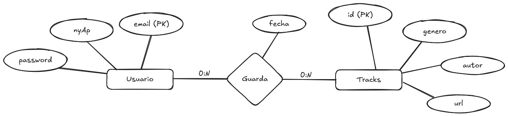

# Proyecto de Ejemplo NodeJS

Este repositorio contiene un proyecto para que sirva de guia para el Proyecto de fin de año de la materia Proyecto, 
Diseño e Implementación de Sistemas computacionales. Contiene un API construida en Express, la cual permite realizar 
operaciones CRUD (Create, Read, Update, Delete) sobre una DB y dar permisos a usuarios mediante JWT

## Modelo Entidad-Relación y mapeo a DB

Para este ejemplo se optó por un sistema de "playlists", donde los usuarios podrían elegir distintos temas o "tracks" y guardarlos como favoritos para tenerlos siempre a mano



En base a este esquema, se obtienen las siguientes relaciones:
```
- USUARIOS<email (PK), nyAp, password>
- TRACK<id_track (PK), genero, autor, url>
- GUARDA<email (PK FK), id_track(PK, FK), fecha >  <-- En base a la relación N:M dada
```

## Creación de proyecto Express

Lo primero que deberíamos hacer es generar un archivo `package.json`, el cuál contendrá toda la información sobre nuestro proyecto y sus dependencias. Para esto deberemos usar el siguiente comando de consola dentro de la carpeta de nuestro proyecto

```cmd
npm init -y
```

Estructura de archivos:

```bash
Proyecto
├───node_modules
│       ...
├───config
│       db.js
├───controllers
│       track.controller.js
│       usuario.controller.js
├───models
│       track.model.js
│       usuario.model.js
├───routes
│        tracks.routes.js
│        usuarios.routes.js
│   .env                  # Variables de entorno
│   .gitignore            # Archivos que git deberia ignorar
│   index.js
│   README.md             # Descripcion del proyecto
```

### Descripcion de carpetas:

- **node_modules/**: Contiene todas las dependencias de nuestro proyecto. Esta carpeta debería estar incluida en el archivo *.gitignore*, ya que es muy grande para subir a github además de que cualquier usuario puede "descargarla" solo teniendo el *package.json*
- **config/**: Contiene configuraciones adicionales que serán necesarias en caso de usar servicios, por ejemplo
- **routes/**: Deberá tener todas las rutas correspondientes a la entidad que representa junto con una llamada al controlador correspondiente
- **controllers/**: Deberá tener la lógica que se deberá ejecutar al acceder a la ruta que lo invoca
- **models/**: Contiene la información sobre la entidad en cuestión